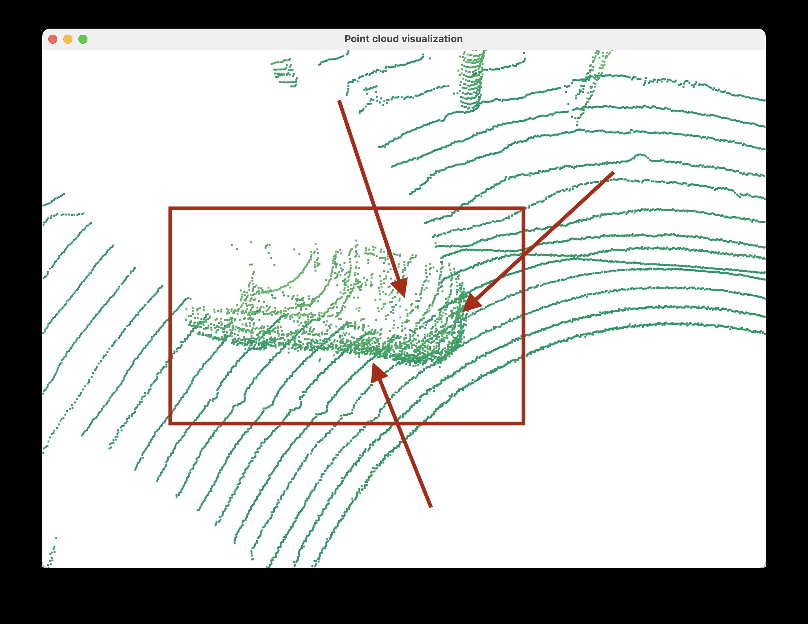
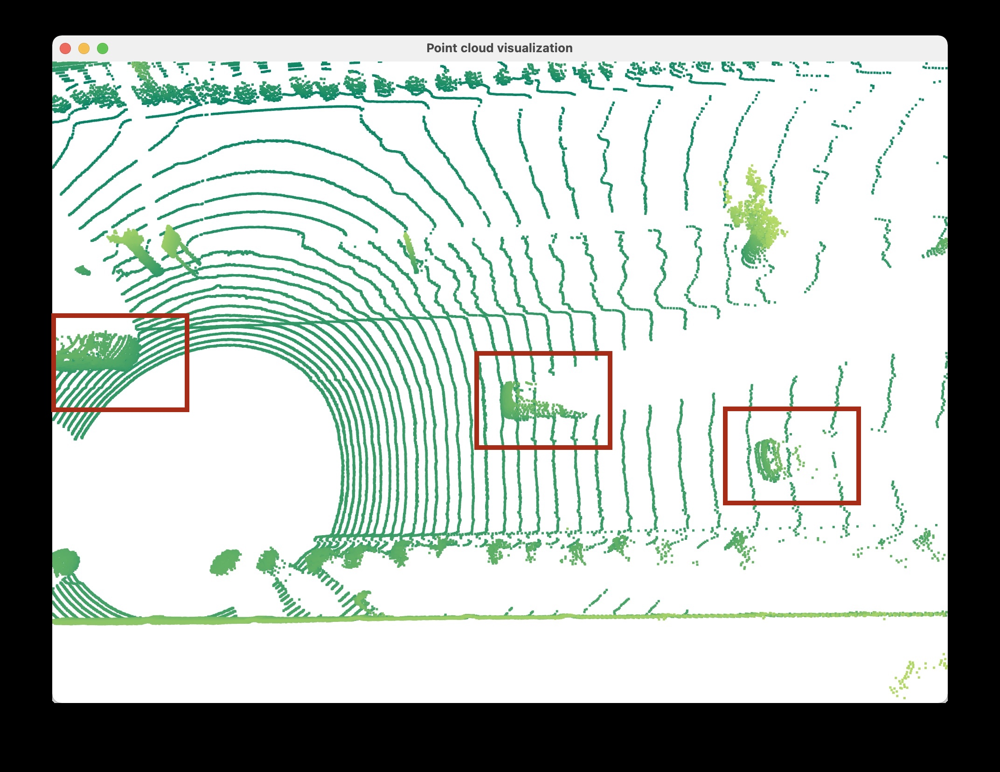
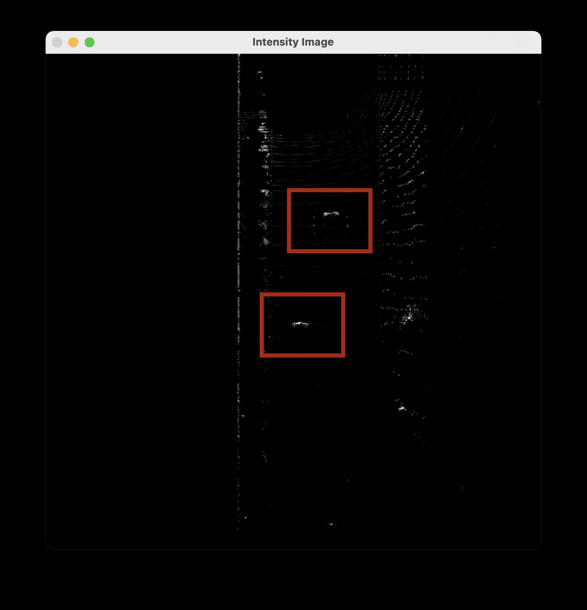
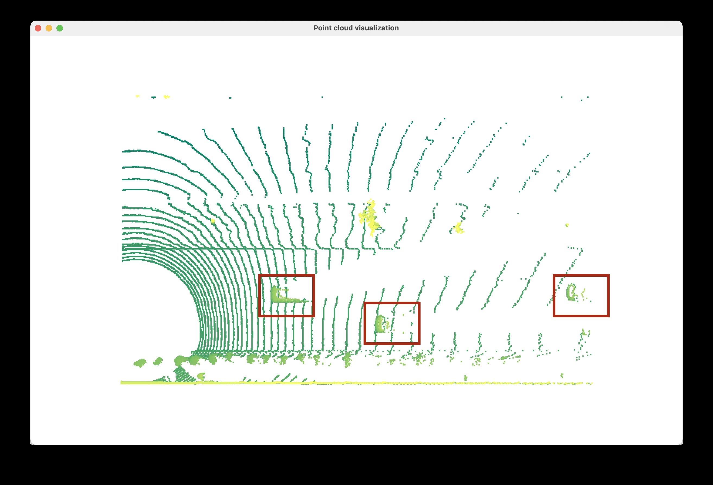
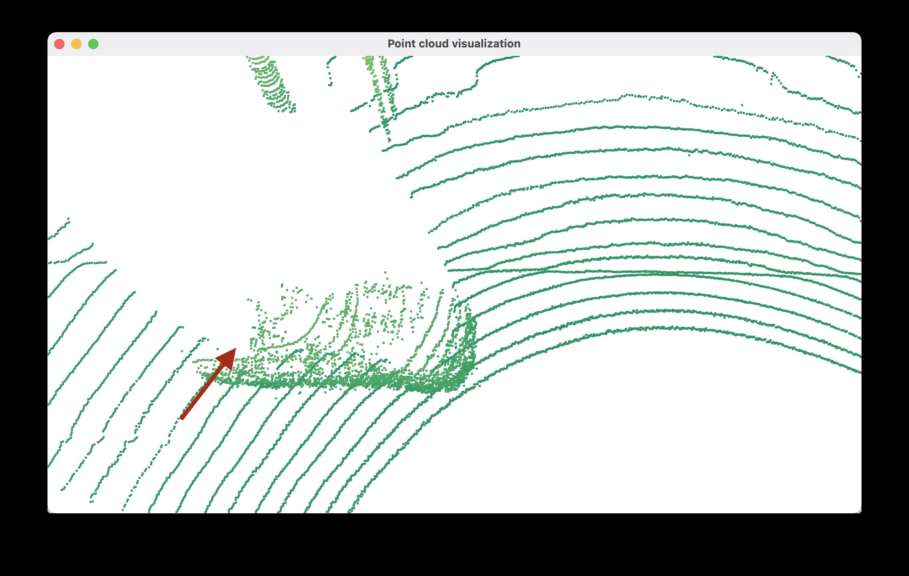
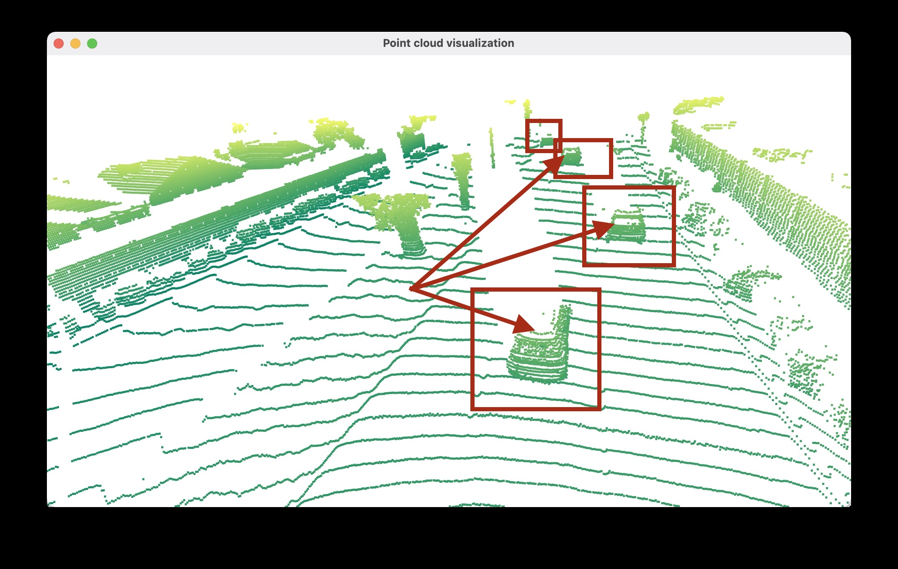
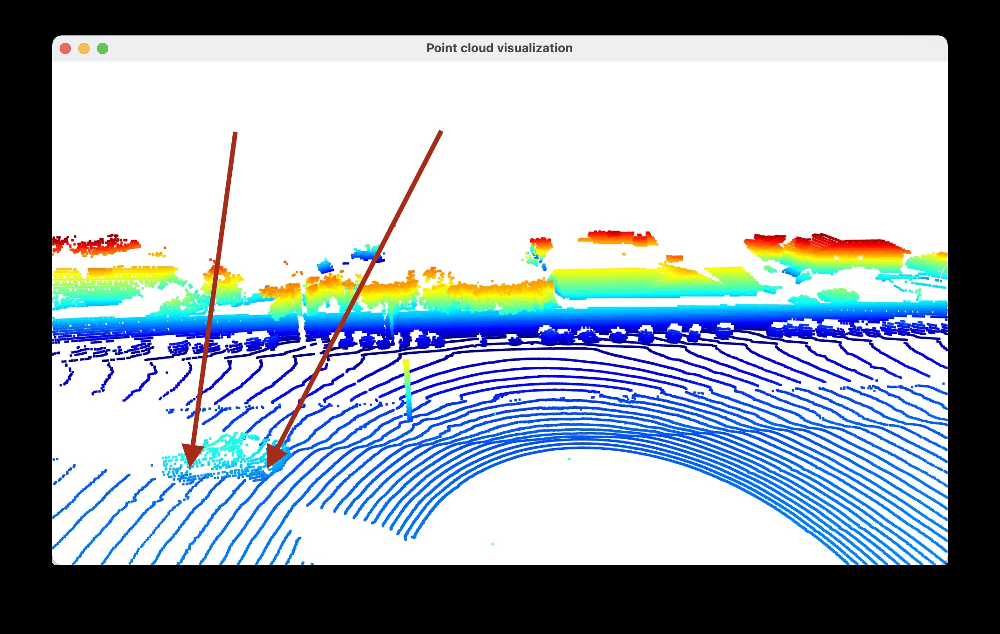

# 3d Object detection using LIDAR

Here are 10 examples of vehicles with varying degrees of visibility in the point-cloud-

In the above image, we can see that the front bumper is clearly visible. Also, the side of the car facing the lidar is also clearly visible. Also, the front hood is also visible.

In the above image, we can see three vehicles. We can only see the portion facing the lidar sensor. Also, if a vehicle is far away, less of its features are captured and with low intensity (example- the vehicle on the far right).

Here, the top view from the front of the car. We can see the second and third car above in this image. Also, the car that is far away has less intensity.

Here, we have another three cars. The car on the far right is far away and is barely visible.

Here, we can see that windows are not reflecting back any light. Hence, they are not visible.

Here, we have four cars and the back window is not visible in any of them. The top most car has barely any features visible because it is very far away.

Here, we have a car and we can clearly see the side two wheels. Also, the windshild is not visible.

## Conclusion

The solid body of the car facing the lidar is very visible. Example- we have seen bumbpers, hoods, side doors, etc in the images above. Also, the wheels are visible.

However, non-reflective surfaces like glass is not visible in any of the images.