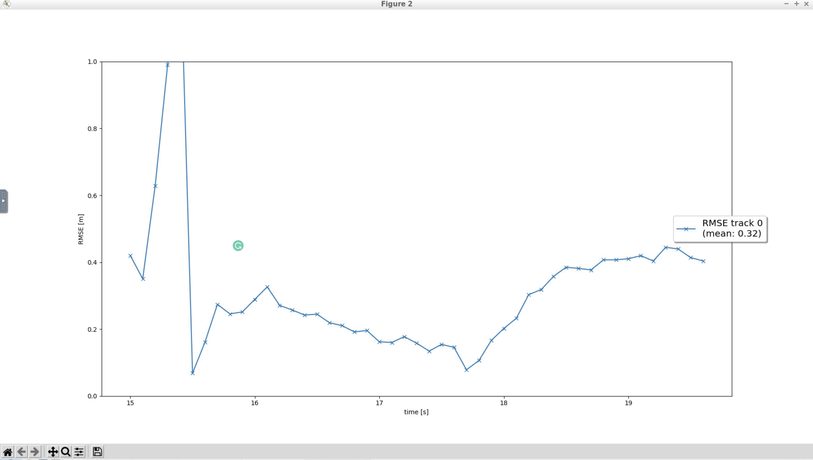
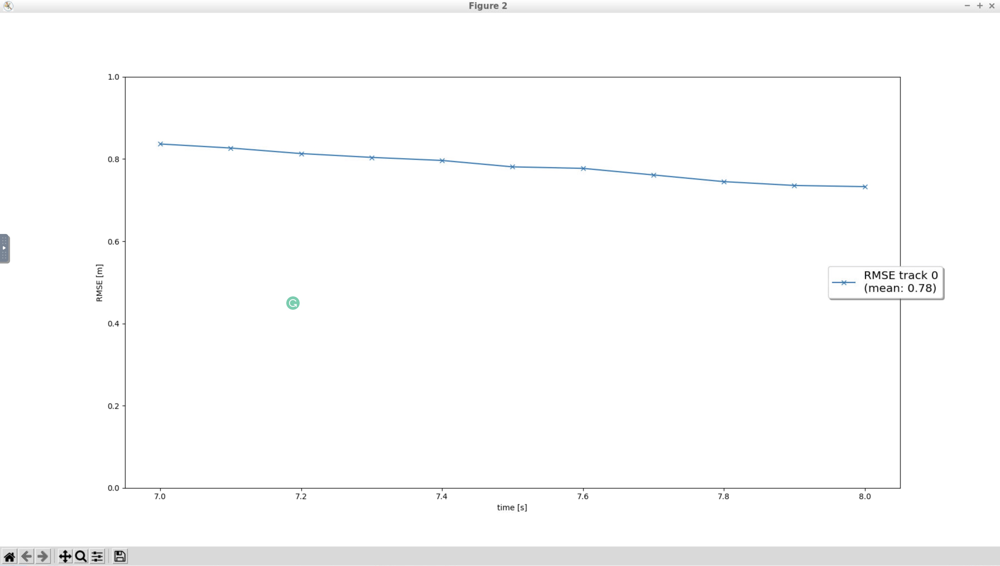
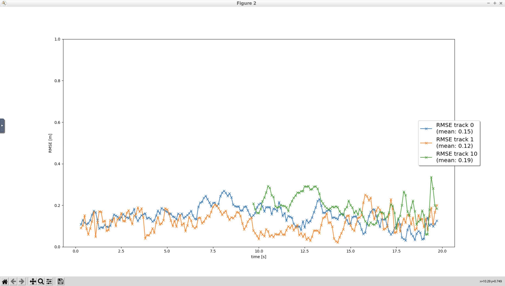
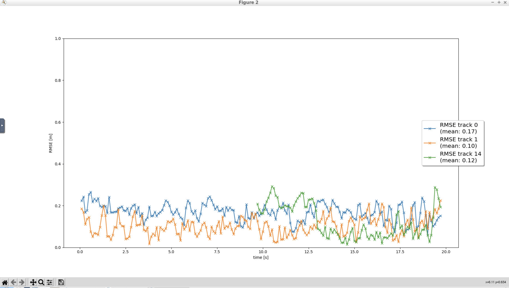

# Writeup: Track 3D-Objects Over Time

### 1. Write a short recap of the four tracking steps and what you implemented there (filter, track management, association, camera fusion). Which results did you achieve? Which part of the project was most difficult for you to complete, and why?

Filter- Here, we implemented the Kalman filter in 3 dimensions.

Track management- Here, we have a tracking algorithm so that we can add/remove/update tracks for detected objects. We also have a score for each object based on which we decide the state- initialized/tentative/confirmed.

Association- When we have n measurements and m tracks, we need to determine which track has to be updated using which measurement. For this we have used the Mahalanobis distance.

Camera fusion- Here, we are using the measurements from both the lidar and camera sensors.

The filter part felt a bit difficult to complete because my concepts were still not clear and I was having difficulty thinking what to write. I had to revisit the lessons and the exercises again in order to complete it and gain confidence for other parts.

### 2. Do you see any benefits in camera-lidar fusion compared to lidar-only tracking (in theory and in your concrete results)?

Yes.
In theory, both lidar and camera have advantages and limitations. Using camera-lidar fusion, we can reduce the limitations and utilize the information that both the sensors are providing. Also, we can combine multiple number of sensors located at different positions and of different types.

In the screenshots below for part 3 and 4, we can see the significant benefit in the second and third tracks. The RMSE is low for these tracks in the last screenshot.

### 3. Which challenges will a sensor fusion system face in real-life scenarios? Did you see any of these challenges in the project?

If the sensors are not properly calibrated or any invalid assumption made in the sensor fusion implementation can cause issues. Also, we need to improve the object detection models on the lidar and camera data so that they can provide more useful and precise information.

### 4. Can you think of ways to improve your tracking results in the future?

Better sensors, better tracking algorithm like the cycle method and better object detection models on the sensor data can help improve the tracking results.

## Results-

View Link - [https://youtu.be/0UH-07_1rSw](https://youtu.be/0UH-07_1rSw)

Part 1-

Part 2-

Part 3-

Part 4-
